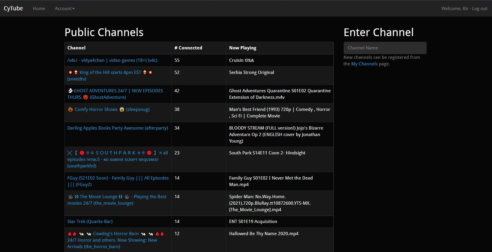
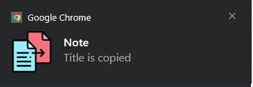

# Chrome extension

## Chrome extension for tracking changes of videos or movies in playlist at cyTube-like sites

- When the next video (or movie) starts to broadcast, extension badge appears (or adds its value by one)
  
- The extension holds state of passed videos (movies) until browser reloading
  
- Clicking on a title of the video (or movie) copies the title to clipboard and triggers windows notification
  

There is button to clear the list storage and button to vote to skip current playing. (Skipping works only if there is enough voted people and if the skip button on the site is not disabled)

The extension works even if the cyTube tab is not active, it has been developed for.
